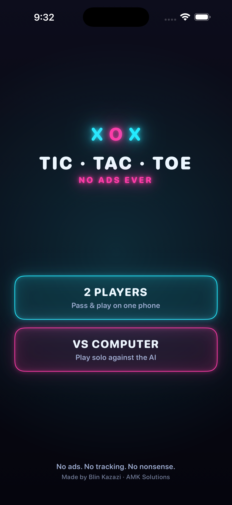
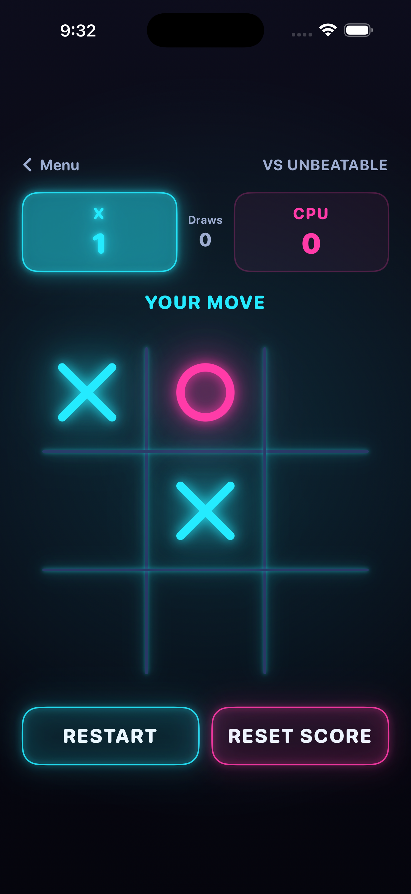
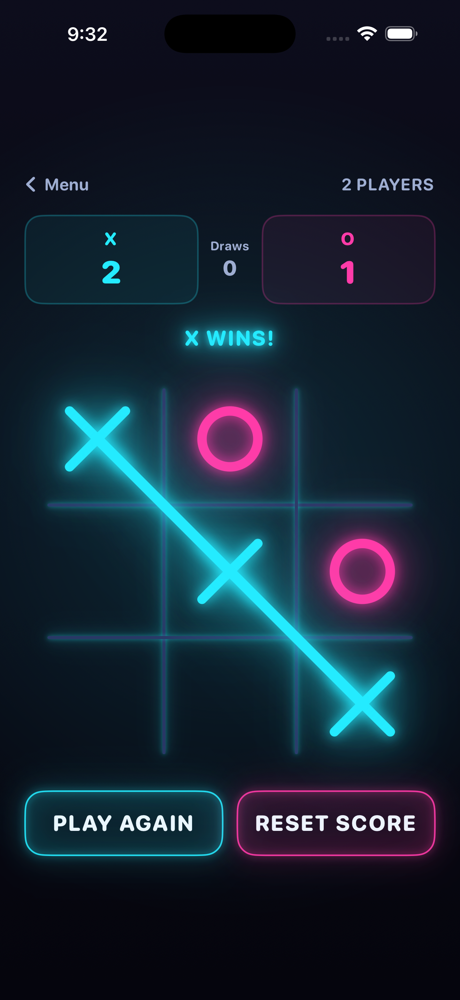
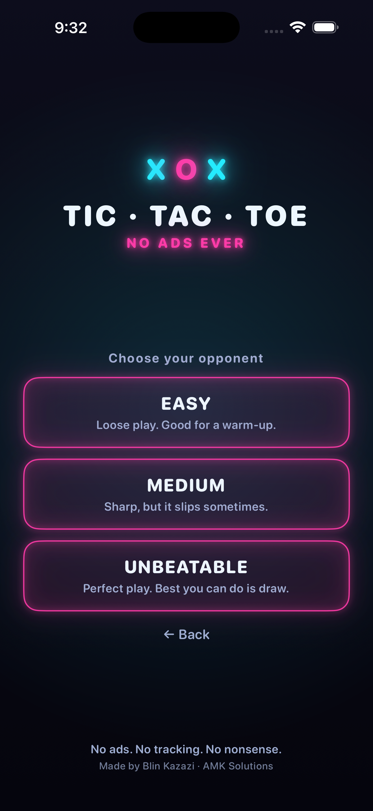

# Tic Tac Toe: No Ads Ever

A neon-arcade Tic Tac Toe for iOS — beautiful, instant, and completely free of ads and tracking.

Built with SwiftUI. Play pass-and-play with a friend on one phone, or go solo against a minimax AI with three difficulty levels — including an Unbeatable mode that plays perfect Tic Tac Toe.

## Screenshots

  
  
  
  

## Features

- **Neon arcade design** — glowing X/O marks, animated win-lines, haptics
- **Two-player** pass & play on a single device
- **Solo vs computer** — Easy, Medium, and Unbeatable (perfect-play minimax)
- **Alternating starts** — X and O take turns going first each round
- Running scoreboard across rounds
- **No ads. No tracking. No accounts. Fully offline.**

## Build & run

1. Clone the repo and open `TicTacToe.xcodeproj` in Xcode 16 or later.
2. Select the **TicTacToe** target → **Signing & Capabilities** and set your own Development Team.
3. Choose an iPhone simulator (or a connected device) and press **⌘R**.

Requires iOS 17+. No third-party dependencies.

## Tech

- SwiftUI, iOS 17+
- Minimax AI opponent (`TicTacToe/AI.swift`)
- App icon generated programmatically with Core Graphics (`scripts/make_icon.swift`)
- File-system-synchronized Xcode project (objectVersion 77)

## Layout

| Path | What |
|------|------|
| `TicTacToe/` | App source (SwiftUI views, game model, AI, theme) |
| `scripts/` | Icon generator + App Store screenshot capture |
| `store/` | App Store listing copy, keywords, privacy answers |
| `screenshots/` | App Store screenshots (iPhone 6.9" + iPad 13") |

## Privacy

The app collects no data — no analytics, no tracking, no network calls. Full policy: <https://amk.solutions/tic-tac-toe-privacy>

## License

MIT — see [LICENSE](LICENSE).

---

Made by **Blin Kazazi** · [AMK Solutions](https://amk.solutions)
